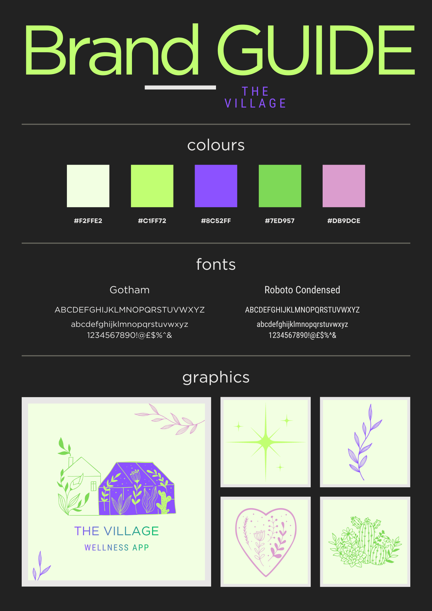
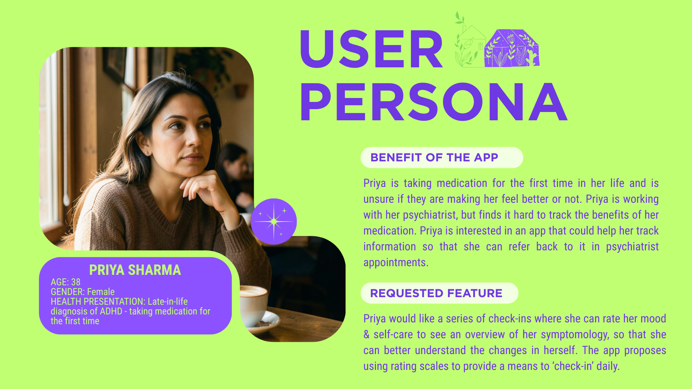

<!-- Inline HTML that changes the banner image based on the chosen theme on GitHub -->
<picture>
  <source media="(prefers-color-scheme: dark)" srcset="./images/banner-dark.png">
  <source media="(prefers-color-scheme: light)" srcset="images/banner-light.png">
  
</picture>

## Navigation

- [The Village Organisation](#the-village-organisation)
- [The Village Wellness App](#the-village-wellness-app)
- [Overview of Documentation](#documentation-cheatsheet)
- [Breakdown: Branding & Collateral](#branding--collateral)
- [Breakdown: Architecture](#architecture)
- [JavaScript Style Guide](./javascript-style-guide.md)
- [Ethical Web Development Principles](#ethical-web-development-principles)
- [License](#license)
- [Authors](#authors)

## The Village Organisation

This project was created as part of an academic Web Development assessment using MongoDB, Express.js, React and Node.js (MERN Stack). The Village organisation is made up of a documentation repository, a backend application repository, and a frontend application respository.

Project work is seperated into two kanban project boards - one was used for [project planning](https://github.com/orgs/The-Village-Wellness-App/projects/2) in the initial stages of the project, and one for [build planning (currently private).](https://github.com/orgs/The-Village-Wellness-App/projects/1)

## The Village Wellness App

The Village Wellness App is a web-based health and wellbeing tracking application designed to help users monitor changes in their mood and physical pain over time. The application allows users to record structured entries using rating scales select predefined labels that describe their emotional or physical state, and optionally add contextual notes.
These entries are then visualised through time-based graphs, enabling users to identify patterns or trends in their wellbeing.

The application also allows users to add event markers to their timeline, such as starting a new medication, beginning therapy, or experiencing a significant life event. These markers provide additional context that may help users understand potential factors influencing their mood or pain levels. By combining structured tracking with visualisation tools, The Village Wellness App aims to support self-reflection and provide users with useful insights that may assist discussions with healthcare professionals.

## Documentation Cheatsheet

TL;DR: You can find a 'Mega doc' of all project planning [documentation here.](./documentation/megadoc-documentation.pdf)

## Hardware Requirements

This project is a standard MERN application, so the minimum hardware requirements are:

- 8 GB RAM or more
- at least 10 GB of free storage space
- an Intel i5 / AMD Ryzen 5 class processor or better
- a functioning laptop or desktop computer
- a modern web browser for using the application
- a working internet connection for development, testing, and dependency installation

A basic development machine is sufficient for running and working on this project.

## Architecture

### Programming Paradigm

The Village app uses a hybrid programming paradigm of functional and data-oriented with limited lightweight object-oriented patterns (objects + instance methods/hook behavior) in the Mongoose model layer.

[Click: Programming Paradigm](./documentation/paradigm-and-architecture.pdf)

### Application Architecture

The Village is built using a client/server architecture typical of the MERN stack. The client
side consists of a React single page application, the server-side is a Node.js application and built using the Express framework. The database is MongoDB.

[Click: Application Architecture](./documentation/how-the-village-uses-client-server-architecture.pdf)

### Software Development Methodologies

Project Management Methodologies

- Agile
- Waterfall

Task Management Methodologies

- Kanban
- Scrum

[Click: Software Development Methodologies](./documentation/software-development-methodologies.pdf)

## Branding & Collateral

### Original Concept

The intention for The Village branding was:

- Community-based
- Welcoming
- Safe
- Online Village

### Brand Guide

The brand guide was developed to ensure that there was a consistent style across documentation and the frontend application:

### Branding Banner

The banner for The Village is utilised on all GitHub, application, and documentation entities, to ensure consisitent messaging, and colouring:

### Personas

The purpose of the app was examined thorugh the use of personas - these personas helped to articulate what the app should do, and who the app is intended for:

### Entity Relationship Diagram

The ERD describes the relationships between entities within the MongoDB database:

### Wireframes

The app design was sketched out via wireframes in order to decide on how features would work, and what the general look of the app will be:

## JavaScript Style Guide

The JavaScript Style Guide was written to ensure consistent coding across documents, and repositories:

[Click: JavaScript Style Guide](./javascript-style-guide.md)

## Ethical Web Development Principles

This MERN project, The Village, will be developed with a commitment to ethical web development. We will design our application to be accessible, inclusive, and usable for all users through progressive enhancement, responsive design, and performanceconscious implementation. We prioritise privacy and security by enforcing HTTPS, safeguarding user data, respecting tracking preferences, and providing transparency around data usage and export.

We also uphold professional responsibility by maintaining well-documented, tested, and version-controlled code in Git/ GitHub, and by engaging respectfully with the wider development community. These principles guide our technical and architectural decisions throughout the project.

We are mindful that:

- Web applications should work for everyone
- Web applications should work everywhere
- Web applications should respect users privacy and security
- Web developers should be considerate of peers

[Click: Web Development Reading](./documentation/ethical-web-development-principles.pdf)

## License

This project is licensed under the MIT License. See the [LICENSE](./LICENSE) file for details.

## Authors

Created by [WhiteHotThrash](https://github.com/tim-maastricht) & [✨BeeGeeEss✨](https://github.com/BeeGeeEss)

Contributions to documentation by [AmeliaFFF](https://github.com/AmeliaFFF)
